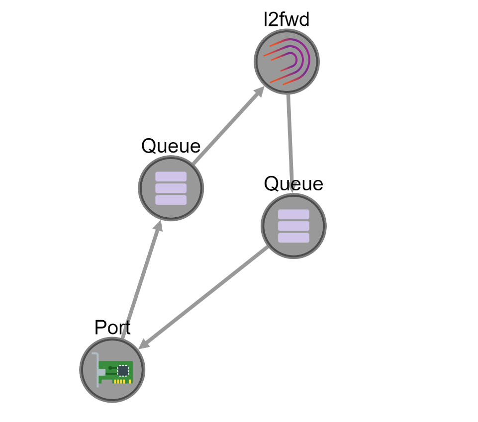

# Node Net

Interactive web app for building network applications in software

## Quick Start Guide

```bash
$ npm install
$ npm start
```

## Early Look

The following screenshot gives an early idea of what idea of this project is, using a simple graphical representation of each block a frame must go through in a software networking app:

